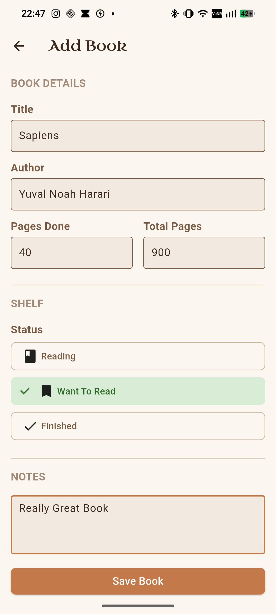
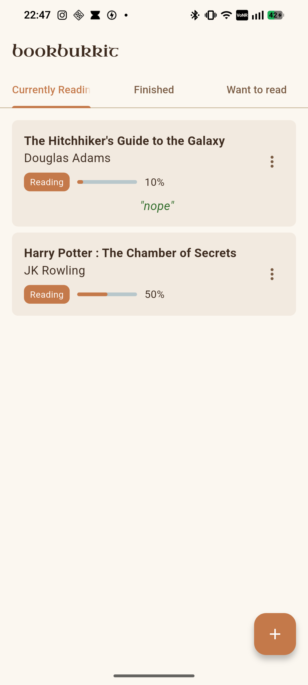

# bookbukkit
A simple, offline mobile app to track books you've read, are currently reading, or want to read.

## Features
- Adding Books
- Tracking how much of a book you've read
- Listing books you've finished
- Listing books you want to read

## Tools Used
- Flutter
- Dart

## How to run
Install the `.apk` file from the releases tab. Only works on android as of now.

## AI Usage
No AI was used in the making of this project. Lots of headaches though.

## Video

## Screenshots

